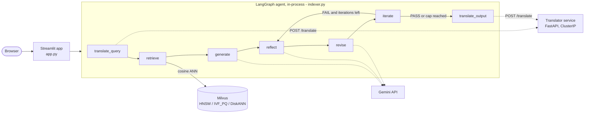

# Multilingual RAG Research Assistant on GKE

Ask questions about a stack of research PDFs in English, Spanish, French, or Italian and get a grounded answer plus two recommended source papers, produced by a self-checking LangGraph agent over a Milvus vector store, deployed on GKE.

 

## What it does

- **Self-checking answers.** A seven-node LangGraph agent translates the question, retrieves the top-K chunks (default 4) from Milvus, generates an answer with Gemini, then runs a reflect, revise, iterate loop (default 2 iterations) where a second Gemini pass audits grounding and output format before the answer is translated back.
- **Four languages.** Queries and answers in English, Spanish, French, or Italian through a standalone FastAPI translator microservice, with a Gemini fallback if the service is unreachable.
- **Three swappable ANN indexes.** HNSW, IVF_PQ, and DiskANN over 3072-dim `gemini-embedding-001` vectors with cosine similarity, plus a benchmark tab that rebuilds the same corpus under each index and times build and query latency.
- **Linked recommendations.** Each recommended paper's URL is HEAD-checked; a missing link is resolved by asking Gemini for the canonical URL and re-checked. Links that cannot be confirmed are shown as "inconclusive", not verified.
- **Cloud deployment.** Streamlit app and translator ship as separate Docker images on GKE; Terraform provisions the cluster and Milvus (Helm), and HPAs are configured for 1 to 5 pods at 70% CPU on both the app and Milvus.

## Architecture



The Streamlit app hosts the whole UI (Upload & Index, Query, Stats & Benchmark tabs) and runs the LangGraph agent in-process. PDFs are extracted with pdfminer, split into sentence-aware word chunks (400 words, 50-word overlap by default), embedded with Gemini, and stored in Milvus tagged with source file, page, and paper type. The translator is cluster-internal only. Note that `revise` always runs at least once after `reflect`; the PASS/FAIL verdict is checked at `iterate` (see [docs/WORKFLOW.md](docs/WORKFLOW.md) for the exact control flow and prompts).

## Quickstart (local)

Requires Python 3.10+, a [Gemini API key](https://aistudio.google.com/app/apikey), and a Milvus instance (for local use, Milvus Standalone via Docker: see the [Milvus install guide](https://milvus.io/docs/install_standalone-docker-compose.md)).

```bash
git clone https://github.com/DevSoVague/multilingual-rag-gke.git
cd multilingual-rag-gke
python3 -m venv .venv && source .venv/bin/activate
pip install -r requirements.txt

cp .env.example .env          # fill in GEMINI_API_KEY (and MILVUS_URI if not localhost)
set -a; source .env; set +a

# terminal 1: translator microservice
uvicorn translator:app --host 127.0.0.1 --port 8080

# terminal 2: the app
streamlit run app.py          # http://localhost:8501
```

| Variable | Purpose |
|---|---|
| `GEMINI_API_KEY` | Gemini embeddings and generation |
| `MILVUS_URI`, `MILVUS_TOKEN` | Milvus endpoint (default `http://localhost:19530`) and optional token |
| `MILVUS_COLLECTION` | Collection name (default `papers_rag`) |
| `TRANSLATOR_URL` | Translator service (default `http://127.0.0.1:8080`) |

### Deploy on GKE

```bash
cd infra/milvus-gke && terraform init && terraform apply -var="project_id=YOUR_PROJECT_ID" && cd ../..
kubectl apply -f k8s/milvus-hpa.yaml
# build images with Cloud Build (Dockerfile.app, Dockerfile.translator), set YOUR_PROJECT_ID in k8s/*.yaml
kubectl create secret generic gemini-api-key --from-literal=GEMINI_API_KEY="<your-key>"
kubectl apply -f k8s/translator.yaml -f k8s/app.yaml
```

Full step-by-step guide (IAM, Artifact Registry, Cloud Build, verification): [docs/GKE_DEPLOYMENT_GUIDE.md](docs/GKE_DEPLOYMENT_GUIDE.md). The 2-node n2-standard-4 cluster costs roughly $0.38/hr per the original deployment notes; run `terraform destroy` when done.

## Data

No PDFs are committed. Upload your own through the Upload & Index tab (each file gets a domain label and an optional URL). [docs/papers.md](docs/papers.md) lists an open-access sample corpus that `scripts/download_papers.sh` can fetch into `./papers/` (git-ignored), and the arXiv papers used in the saved benchmark run. `scripts/validate_papers.py` checks downloads for broken or image-only PDFs before indexing.

## Results

Index benchmark from the Stats & Benchmark tab (`benchmarks/run_20260227_005733_results.csv`): one query ("Summarize the main contribution of the papers and cite sources."), top-K 4, 648 chunks, single-node Milvus, single run (not averaged).

| Index | Build (s) | One query (s) | End-to-end (s) |
|---|---|---|---|
| HNSW | 5.38 | 5.73 | 11.39 |
| IVF_PQ | 5.24 | 5.61 | 11.14 |
| DiskANN | 5.15 | 5.34 | 10.77 |

At this corpus size the three indexes land within about 0.4 s of each other per query, so latency is dominated by the Gemini calls, not the vector search. The benchmark also reports a storage column, but it is an estimate (vectors x dim x 4 bytes x a per-method factor), not a measurement, so it is omitted here. There is no automated answer-quality evaluation.

## Project structure

```
.
├── app.py                  # Streamlit UI: upload/index, query, stats and benchmark
├── indexer.py              # PDFIndexer: chunking, Gemini embeddings, Milvus, LangGraph agent
├── translator.py           # FastAPI translation microservice (EN/ES/FR/IT)
├── Dockerfile.app / Dockerfile.translator
├── k8s/                    # Deployments, Services, HPAs (app, translator, Milvus)
├── infra/milvus-gke/       # Terraform: GKE cluster + Milvus/Attu via Helm
├── scripts/                # download_papers.sh, validate_papers.py
├── benchmarks/             # saved index benchmark result
└── docs/                   # deployment guide, workflow, project tour, full reference
```

More detail: [docs/PROJECT_TOUR.md](docs/PROJECT_TOUR.md) (overview and design decisions), [docs/WORKFLOW.md](docs/WORKFLOW.md) (step-by-step runtime flow), [docs/REFERENCE.md](docs/REFERENCE.md) (original full README: schema, HPA, limitations).

## Team & credits

Course project for CMU 14-825 (Spring 2026), Option 1: Research Assistant Agent with RAG Pipelines.
Team of 2: Devavrath Sandeep (team lead) and Achintya Gahalaut.

## License

[MIT](LICENSE)
