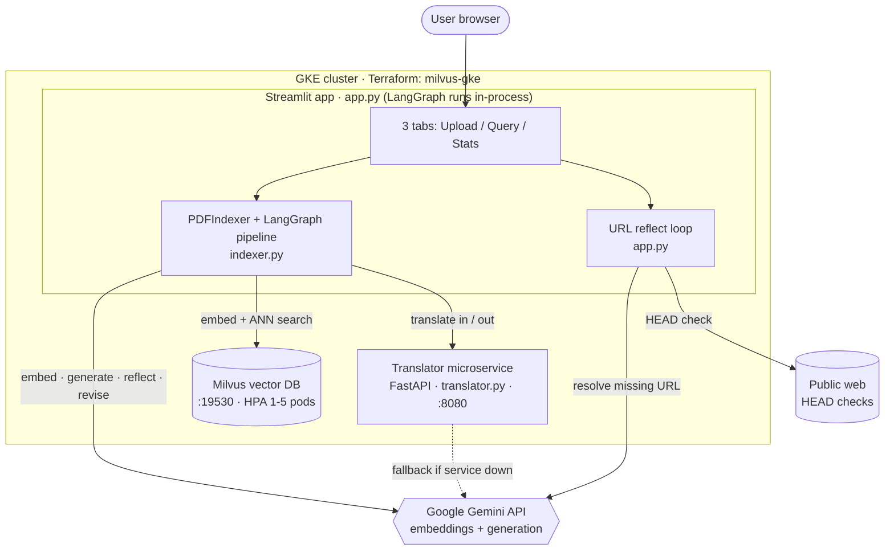

# Project Tour - PDF RAG (Gemini + LangGraph + Milvus)

> A walk-around for someone meeting this codebase cold. For the step-by-step
> "what happens when you press a button" view, see [WORKFLOW.md](WORKFLOW.md).

---

## 1. TL;DR

This is a **multilingual research-assistant app**: you upload PDFs, it chunks and
embeds them into a [Milvus](https://milvus.io) vector database, and then you ask
questions in English, Spanish, French, or Italian and get a short, source-grounded
answer plus two recommended papers with working links. What makes it more than a
toy is the **self-checking answer loop** - a [LangGraph](https://langchain-ai.github.io/langgraph/)
agent that generates an answer, critiques its own grounding and formatting, and
rewrites it before showing it to you - and a benchmark tab that builds the same
corpus under three different vector-index algorithms and times them side by side.

---

## 2. The problem

If you drop a stack of research PDFs into a plain chatbot, two things go wrong.
First, the model **makes things up** - it cites papers that aren't in your corpus,
or asserts claims the papers don't support. Second, it only really works **in
English and for whoever is technical enough to run it**. A clinician who reads
Spanish, or a student who wants "which two of these 60 papers actually answer my
question, with links," is left out.

The obvious alternative - a single "stuff the PDF text into one prompt and ask" call  - 
falls over on both counts. It has no retrieval, so it can't scale past a couple of
short papers; it has no grounding check, so it hallucinates freely; and it has no
translation layer, so it's English-only. This project's bet is that the fix isn't a
bigger prompt but a **pipeline**: retrieve the right chunks, generate, then run a
second model pass whose only job is to catch the first pass lying or breaking format.

---

## 3. What it does

You work in a three-tab Streamlit app ([app.py:549](../app.py#L549)):

- **Upload & Index** - Drop one or more PDFs, tag each with a paper type, and hit
  *Start Indexing*. A live progress bar walks you through extraction (pdfminer),
  embedding (Gemini, 3072-dim), and index building (Milvus). You can preview the
  first five chunks and optionally cache them so the benchmark tab has something to
  chew on ([app.py:596-746](../app.py#L596-L746)).
- **Query** - A chat box. You pick your query language and, optionally, a paper-type
  filter, then ask. You get a 4-6-sentence grounded answer, a **"Recommended papers
  (top 2)"** block with links, an expandable **URL reflection trace** showing how each
  link was checked or repaired, and an expander with the exact retrieved chunks and
  their similarity scores ([app.py:762-885](../app.py#L762-L885)).
- **Stats & Benchmark** - Metrics on the current index, and a one-click benchmark that
  rebuilds the cached chunks under **HNSW, IVF_PQ, and DiskANN**, runs the same query
  against each, and gives you a downloadable CSV of build time, query latency, and
  estimated storage per method ([app.py:893-1029](../app.py#L893-L1029)).

---

## 4. Who uses it

The "users" are hypothetical - this is a **CMU course project** (GenAI, Option #1:
"Research Assistant Agent with RAG Pipelines"), and its intended deployment context is
a **GKE cluster** the authors stand up with Terraform, use, and tear down. Two personas
are implied by the design:

- **A researcher / clinician** who has a folder of papers and a question, possibly not
  in English. They live in the Query tab and never think about vectors.
- **The developer / grader** who wants to *see the engineering* - that the reflect loop
  works, that three index types are genuinely swappable, that it deploys and autoscales
  on Kubernetes. The Stats & Benchmark tab and the deployment guide exist for them.

---

## 5. How it's built

- **Streamlit app - [app.py](../app.py)** - the whole UI and all session state. Three
  tabs, a sidebar of knobs (index type, chunk size, Gemini model, top-K, reflection
  iterations), and the URL-reflect post-processor. Framework: `streamlit`. Note the
  LangGraph agent runs **in the same process** as the UI - there is no separate
  "agent service."
- **RAG engine - [indexer.py](../indexer.py)** - the `PDFIndexer` class does PDF text
  extraction (`pdfminer.six`), sentence-aware chunking with overlap, Gemini embedding
  (`gemini-embedding-001`, 3072-dim), Milvus collection/index management (`pymilvus`),
  and the LangGraph state machine that answers queries. This is the heart of the
  project ([indexer.py:220](../indexer.py#L220)).
- **Translator - [translator.py](../translator.py)** - a ~60-line FastAPI service wrapping
  `deep-translator`'s Google Translate backend, supporting EN/ES/FR/IT. Deployed
  `ClusterIP` (internal-only). If it's unreachable, the engine silently falls back to
  translating with Gemini ([indexer.py:109-127](../indexer.py#L109-L127)).
- **Milvus** - the vector store, deployed via Terraform into its own namespace with a
  Horizontal Pod Autoscaler (1-5 pods at 70% CPU). Holds one collection per index run;
  schema is chunk_id / source / page / paper_type / text / embedding
  ([indexer.py:289-327](../indexer.py#L289-L327)).
- **Infra - [milvus-gke/](../infra/milvus-gke/), [app.yaml](../k8s/app.yaml), [translator.yaml](../k8s/translator.yaml)**  - 
  Terraform for the cluster + Milvus, Kubernetes Deployments/Services/HPA for the two
  app containers. `Dockerfile.app` and `Dockerfile.translator` build the images.

---

## 6. The key decisions

- **Decision:** A **reflect → revise loop** on top of generation, instead of trusting a
  single Gemini call.
  **Why:** The grading rubric (and the honest problem) is hallucination and format
  drift - inventing papers, wrong section headers, more than two recommendations.
  A second model pass with a strict PASS/FAIL rubric catches these
  ([indexer.py:133-163](../indexer.py#L133-L163)).
  **Trade-off:** Latency and cost. Each iteration is one extra Gemini call (~2-5s).
  Default is 2 iterations, so a query can be 4-5 model calls deep.
  **⚠️ Mismatch to flag:** The README's diagram shows `reflect --PASS--> translate_output`
  and `reflect --FAIL--> revise`, i.e. revise only runs on failure. **The actual code
  wires `reflect → revise` unconditionally** ([indexer.py:816](../indexer.py#L816)) and only
  checks the verdict one node later at `iterate`. So **revise always runs at least once,
  even when reflect said PASS**, and that final rewrite is never re-checked. See the
  gotcha in [WORKFLOW.md](WORKFLOW.md).

- **Decision:** A **standalone translator microservice**, with a Gemini fallback baked in.
  **Why:** Keeps translation cheap and separable (`deep-translator` is free), and the
  fallback means a translator outage degrades quality instead of breaking the app
  ([indexer.py:109-127](../indexer.py#L109-L127)).
  **Trade-off:** Two language layers can fight - the generate node *also* asks Gemini to
  answer in the target language, then translate_output translates again. On non-English
  queries this can double-translate. (Detailed in [WORKFLOW.md](WORKFLOW.md).)

- **Decision:** Make **the vector index algorithm a first-class, swappable choice**
  (HNSW / IVF_PQ / DiskANN), rebuilt cleanly per run.
  **Why:** The benchmark is a deliverable - the point is to *show* the trade-offs, so
  each method gets its own fresh collection to keep comparisons fair
  ([app.py:362-367](../app.py#L362-L367), [indexer.py:329-367](../indexer.py#L329-L367)).
  **Trade-off:** Rebuilding from scratch per method is slower than reusing an index, and
  DiskANN may not exist on a given Milvus build (handled: that row is marked FAILED).

- **Decision:** **Estimate** vector storage with a per-method multiplier rather than
  measuring it.
  **Why:** Measuring true on-disk index size across three Milvus index types is fiddly;
  a formula (`n × dim × 4 bytes`, then ×1.4 HNSW / ×0.3 IVF_PQ / ×1.3 DiskANN) is good
  enough to illustrate the RAM-vs-compression story ([app.py:355-367](../app.py#L355-L367)).
  **Trade-off:** The storage column in the benchmark CSV is **synthetic**, not measured  - 
  build time and query latency *are* real wall-clock numbers, but storage is not.

- **Decision:** **User-driven language selection** via a dropdown, not auto-detection.
  **Why:** Simpler and deterministic; the retrieval always happens in English regardless
  of query language ([app.py:456-459](../app.py#L456-L459)).
  **Trade-off:** If the user picks the wrong language, the translate-in step mangles the
  query.

- **Decision:** **Boring-but-correct** - cosine similarity everywhere, `auto_id` primary
  keys, one shard, `Strong` consistency on search.
  **Why:** The corpus is small (hundreds to low-thousands of chunks); there's no reason
  to tune for scale, and Strong consistency avoids "I just indexed it but can't find it"
  surprises ([indexer.py:604-612](../indexer.py#L604-L612)).
  **Trade-off:** Single-shard, single-node Milvus has no replication - fine for a course
  project, not production.

---

## 7. What it's good at, what it isn't

**Good at**
- Turning a folder of English PDFs into grounded, two-source answers with format
  discipline (bullet points, exactly two papers, exact header) enforced by the reflect
  rubric.
- Demonstrating an ANN index comparison end-to-end with real build/latency timings on
  the same corpus and query.
- Deploying as real cloud infrastructure: containerized services, Terraform-provisioned
  Milvus, and HPA on both the app and the vector DB.
- Degrading gracefully - translator down → Gemini fallback; DiskANN unsupported → other
  two methods still complete; interrupt button stops long jobs mid-flight.

**Not designed for**
- **Scale or durability.** Single-node Milvus, no replication; Streamlit session state
  (indexed-file list, URL map) is lost on pod restart while the Milvus data survives.
- **Trustworthy storage numbers.** The benchmark's storage column is a multiplier-based
  estimate, not a measurement.
- **A corpus that matches its own labels.** The shipped `papers/` folder and
  [download_papers.sh](download_papers.sh) are **60 clinical-nutrition PDFs**
  (preoperative / postoperative / ICU / general), yet the code's paper-type taxonomy is
  `AI / ML`, `Security`, `Other` ([indexer.py:51-55](../indexer.py#L51-L55)) and the saved
  benchmark runs were done on AI papers (`AI_04_LLaMA_2.pdf`, `AI_02_BERT.pdf`). The
  README claims "30 papers (10 AI, 10 Security, 10 Other)." The domain drifted; the
  labels didn't follow.
- **Non-English source documents.** Retrieval embeds and searches in English; the
  assumption is all papers are English.

---

## 8. What's next

Ranked roughly by return on effort:

1. **Revoke and rotate the leaked Gemini API key.** A real key is committed in plaintext
   in [somecommands.txt](somecommands.txt). Revoke it in Google AI Studio, delete it from
   the file, and load keys only from `config.env` / Kubernetes secrets (`app.yaml`
   already uses a placeholder env var - wire it to a real Secret rather than an inline
   value).
2. **Fix the entrypoint drift before the next image build.** [Dockerfile.app](Dockerfile.app)
   copies and runs `app3.py`, [somecommands.txt](somecommands.txt) says `app2.py`, but the
   real file is `app.py`. A rebuilt image would not contain the current UI. Rename to a
   single `app.py` everywhere.
3. **Make the reflect loop match its own diagram** - either route `reflect --PASS-->
   translate_output` directly (so a good answer is never blindly rewritten), or re-reflect
   after the final revise. Today the returned answer is always an unvalidated rewrite.
4. **Reconcile the corpus with the labels** - either re-tag the taxonomy to
   `preoperative / postoperative / ICU / general` to match the nutrition corpus, or ship
   the AI/Security papers the labels and benchmarks assume.
5. **Measure storage instead of estimating it** - read the actual index size back from
   Milvus (`get_index_build_progress` / segment stats) so the benchmark's storage column
   is real.

---

## 9. Reading order for the codebase

1. **[README.md](REFERENCE.md)** §System Architecture + §LangGraph Agent Pipeline - the
   authors' intended mental model (but trust the code where they disagree; see §6).
2. **[indexer.py:39-92](../indexer.py#L39-L92)** - the config block: models, index types,
   the hardcoded `OUTPUT_FORMAT_INSTRUCTIONS`, translator URL. This is the vocabulary for
   everything else.
3. **[indexer.py:398-476](../indexer.py#L398-L476)** - extract → chunk. The concrete
   "what is a chunk" that the rest operates on.
4. **[indexer.py:632-826](../indexer.py#L632-L826)** - `_build_graph`: the seven LangGraph
   nodes and the routing. **This is the aha.** Trace the edges by hand.
5. **[indexer.py:133-193](../indexer.py#L133-L193)** - the reflect and revise prompt
   templates, verbatim. Read them alongside the nodes that use them.
6. **[app.py:596-746](../app.py#L596-L746)** - the indexing tab: how uploads become the
   `embedded_chunks` that `build_index` consumes.
7. **[app.py:181-269](../app.py#L181-L269)** - the URL reflect pattern, the post-answer
   loop that lives in the UI layer, not the graph.
8. **[app.py:313-449](../app.py#L313-L449)** - the benchmark harness, to see how one corpus
   is rebuilt under three index types.

---

_Cross-reference: [WORKFLOW.md](WORKFLOW.md) for the runtime
sequence._
