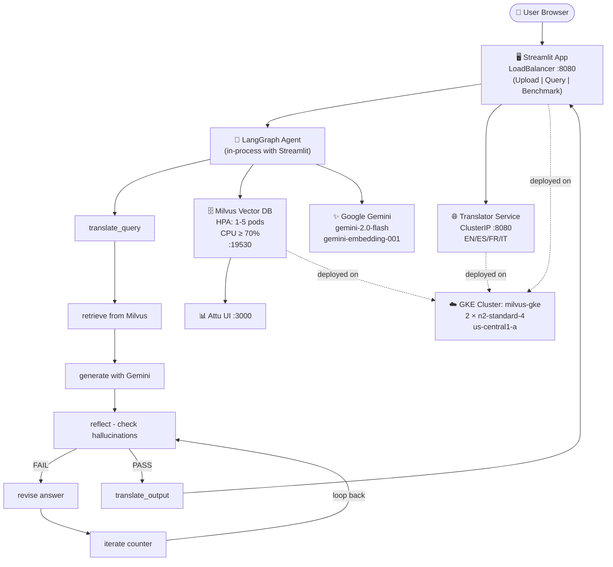

# PDF RAG - Gemini + LangGraph + Milvus on GKE

A cloud-native, multilingual Retrieval-Augmented Generation (RAG) system deployed on Google Kubernetes Engine. Upload academic research PDFs across three domains, index them into a Milvus vector store, and ask questions in English, Spanish, French, or Italian - receiving grounded, hallucination-minimized answers with paper recommendations, all powered by Google Gemini and a LangGraph agent pipeline.

> **Team:** Achintya Gahalaut, Devavrath Sandeep (Carnegie Mellon University, Spring 2026)
> **Project:** Option #1 - Research Assistant Agent with RAG Pipelines
> **GCP Project:** `YOUR_PROJECT_ID` | **Region:** `us-central1` | **Cluster:** `milvus-gke`

---

## Table of Contents

1. [System Architecture](#system-architecture)
2. [Architecture Diagram (Mind Map)](#architecture-diagram-mind-map)
3. [Services Overview](#services-overview)
4. [Prerequisites](#prerequisites)
5. [Full Deployment Guide (GKE)](#full-deployment-guide-gke)
   - [Step 1 - Authenticate & Configure gcloud](#step-1--authenticate--configure-gcloud)
   - [Step 2 - Enable Required APIs](#step-2--enable-required-apis)
   - [Step 3 - Grant IAM Permissions](#step-3--grant-iam-permissions)
   - [Step 4 - Deploy GKE Cluster + Milvus via Terraform](#step-4--deploy-gke-cluster--milvus-via-terraform)
   - [Step 5 - Apply Milvus HPA](#step-5--apply-milvus-hpa)
   - [Step 6 - Create Artifact Registry Repository](#step-6--create-artifact-registry-repository)
   - [Step 7 - Build & Push Images via Cloud Build](#step-7--build--push-images-via-cloud-build)
   - [Step 8 - Add Your Gemini API Key](#step-8--add-your-gemini-api-key)
   - [Step 9 - Deploy the Translator Service](#step-9--deploy-the-translator-service)
   - [Step 10 - Deploy the RAG App + App HPA](#step-10--deploy-the-rag-app--app-hpa)
   - [Step 11 - Access the App](#step-11--access-the-app)
   - [Step 12 - Verify Each Service](#step-12--verify-each-service)
6. [Application Workflow](#application-workflow)
7. [LangGraph Agent Pipeline](#langgraph-agent-pipeline)
8. [Anti-Hallucination Strategy](#anti-hallucination-strategy)
9. [Multilingual Support](#multilingual-support)
10. [RAG Pipeline & Vector Database](#rag-pipeline--vector-database)
11. [Index Type Comparison (HNSW vs IVF_PQ vs DiskANN)](#index-type-comparison)
12. [Horizontal Pod Autoscaling](#horizontal-pod-autoscaling)
13. [Milvus Collection Schema](#milvus-collection-schema)
14. [Environment Variables Reference](#environment-variables-reference)
15. [Quick Reference Commands](#quick-reference-commands)
16. [Local Development](#local-development)
17. [File Structure](#file-structure)
18. [Limitations & Assumptions](#limitations--assumptions)
19. [Cost Warning](#cost-warning)

---

## System Architecture

```
┌─────────────────────────────────────────────────────────────┐
│                        User's Browser                        │
└───────────────────────────┬─────────────────────────────────┘
                            │  HTTP :8080
                            ▼
┌─────────────────────────────────────────────────────────────┐
│         Streamlit App  (LoadBalancer)                        │
│         Tabs: Upload & Index | Query | Stats & Benchmark     │
└───────┬──────────────────────────┬──────────────────────────┘
        │  Embed / Query           │  Translation requests
        │  (in-process LangGraph)  │  HTTP :8080
        ▼                          ▼
┌────────────────┐      ┌──────────────────────────┐
│  Milvus        │      │  Translator Service       │
│  (namespace:   │      │  (ClusterIP :8080)        │
│   milvus)      │      │  EN / ES / FR / IT        │
│  LoadBalancer  │      └──────────────────────────┘
│  :19530        │
│  HPA: 1-5 pods │
│  CPU ≥ 70%     │
└────────────────┘
        │
        ▼
┌────────────────┐
│  Attu Web UI   │
│  LoadBalancer  │
│  :3000         │
└────────────────┘

GKE Cluster: milvus-gke  |  2 × n2-standard-4 nodes  |  us-central1-a
```

---

## Architecture Diagram (Mind Map)

To generate a visual, interactive mind map of this architecture automatically, paste the following prompt into [Claude.ai](https://claude.ai) or any Claude interface:

> **Prompt to paste into Claude:**
>
> ```
> Create a visual SVG mind map of this system architecture:
>
> Central node: "PDF RAG System"
>
> Branch 1 - "GKE Cluster (milvus-gke)"
>   - 2 × n2-standard-4 nodes
>   - us-central1-a
>   - Terraform managed
>
> Branch 2 - "Streamlit App (LoadBalancer :8080)"
>   - Tab: Upload & Index
>   - Tab: Query (multilingual)
>   - Tab: Stats & Benchmark
>   - Talks to Milvus + Translator
>
> Branch 3 - "LangGraph Agent Pipeline"
>   - translate_query
>   - retrieve (Milvus ANN)
>   - generate (Gemini)
>   - reflect (hallucination check)
>   - revise (fix issues)
>   - iterate (loop up to N times)
>   - translate_output
>
> Branch 4 - "Milvus Vector DB (HPA 1-5)"
>   - gemini-embedding-001 (3072-dim)
>   - Index: HNSW / IVF_PQ / DiskANN
>   - Cosine similarity
>   - 30 papers (10 AI, 10 Security, 10 Other)
>
> Branch 5 - "Translator Service (ClusterIP)"
>   - deep-translator (GoogleTranslate)
>   - EN / ES / FR / IT
>   - FastAPI
>   - Containerized on GKE
>
> Branch 6 - "Google Gemini"
>   - gemini-2.0-flash (default)
>   - gemini-embedding-001
>   - URL resolution fallback
>
> Use color coding: blue for infrastructure, green for AI/ML, orange for services, purple for data.
> ```

Alternatively, paste the prompt into [Mermaid Live Editor](https://mermaid.live) using this Mermaid source:



---

## Services Overview

The system is made up of four independently deployed components, all running on the same GKE cluster:

**1. Milvus (Vector Database)** stores embeddings for 30 academic papers across three domains. Deployed via Terraform into the `milvus` namespace with HPA enabled (1-5 pods, CPU ≥ 70%). Accompanied by an Attu UI for visualization.

**2. Translator Service** is a lightweight FastAPI microservice using `deep-translator` (Google Translate backend) to convert queries and answers between English, Spanish, French, and Italian. Deployed as a `ClusterIP` service - only reachable from within the cluster.

**3. LangGraph RAG Agent** is the central orchestrator. It runs as part of the Streamlit process and coordinates all three other services. It handles PDF chunking, embedding, Milvus indexing, semantic retrieval, Gemini-powered generation, reflection-based revision, and multilingual output translation.

**4. Streamlit App** provides the full web UI. It is exposed via a `LoadBalancer` on port 8080 and supports three tabs: Upload & Index, Query, and Stats & Benchmark.

---

## Prerequisites

Before deploying, make sure you have the following:

- A Google Cloud project with billing enabled (`YOUR_PROJECT_ID`)
- GCP IAM roles: **Artifact Registry Admin**, **Storage Admin**, **Cloud Build Editor**
- `gcloud` CLI authenticated in your Google Cloud Shell
- Terraform installed (available by default in Cloud Shell)
- A Google Gemini API key from [Google AI Studio](https://aistudio.google.com)

---

## Full Deployment Guide (GKE)

### Step 1 - Authenticate & Configure gcloud

```bash
gcloud auth login
gcloud config set project YOUR_PROJECT_ID
gcloud config set compute/region us-central1
gcloud config set compute/zone us-central1-a
```

### Step 2 - Enable Required APIs

```bash
gcloud services enable container.googleapis.com
gcloud services enable artifactregistry.googleapis.com
gcloud services enable cloudbuild.googleapis.com
```

### Step 3 - Grant IAM Permissions

Cloud Build requires explicit permissions. Run this once per user:

```bash
gcloud projects add-iam-policy-binding YOUR_PROJECT_ID \
  --member="user:YOUR_EMAIL@example.com" \
  --role="roles/cloudbuild.builds.editor"

gcloud projects add-iam-policy-binding YOUR_PROJECT_ID \
  --member="user:YOUR_EMAIL@example.com" \
  --role="roles/storage.admin"
```

> Without these, `gcloud builds submit` returns `PERMISSION_DENIED`.

### Step 4 - Deploy GKE Cluster + Milvus via Terraform

Navigate to the Terraform folder and apply:

```bash
cd infra/milvus-gke
terraform init
terraform apply -var="project_id=YOUR_PROJECT_ID"
```

Type `yes` when prompted. This takes 5-10 minutes and creates:
- A GKE cluster named `milvus-gke` with **2 × n2-standard-4 nodes**
- Milvus Standalone (with etcd, MinIO, RocksMQ - no Pulsar overhead)
- Attu web UI for Milvus management
- All services exposed via LoadBalancer

> `variables.tf` change: `node_count` was updated from `1` to `2` so Milvus pods have enough room to schedule alongside etcd and MinIO.

Once complete, connect `kubectl` to the cluster:

```bash
gcloud container clusters get-credentials milvus-gke --zone us-central1-a
kubectl get nodes
# Should show 2 nodes with STATUS=Ready
```

Verify Milvus is running:

```bash
kubectl get pods -n milvus
# All pods should show Running
kubectl get svc -n milvus
```

> **Important:** The cluster is named `milvus-gke`, not `rag-cluster`.

### Step 5 - Apply Milvus HPA

The assignment requires the vector database to autoscale (min 1, max 5, CPU ≥ 70%). Apply after Milvus is running:

```bash
cd multilingual-rag-gke   # repo root
kubectl apply -f k8s/milvus-hpa.yaml

# Verify
kubectl get hpa -n milvus
```

### Step 6 - Create Artifact Registry Repository

```bash
gcloud artifacts repositories create rag-project \
  --repository-format docker \
  --location us-central1
```

> If it already exists you will see `ALREADY_EXISTS` - skip ahead.

### Step 7 - Build & Push Images via Cloud Build

> **Do not use `docker push` directly.** Cloud Shell blocks outbound TCP:443 to Artifact Registry. Use Cloud Build instead - it builds and pushes entirely within Google's infrastructure.

Make sure you are in the project folder:

```bash
cd multilingual-rag-gke   # repo root
```

**7a - Translator Image**

```bash
cat > /tmp/build-translator.yaml << 'EOF'
steps:
- name: 'gcr.io/cloud-builders/docker'
  args: ['build', '-f', 'Dockerfile.translator', '-t', 'us-central1-docker.pkg.dev/YOUR_PROJECT_ID/rag-project/translator:v1', '.']
images:
- 'us-central1-docker.pkg.dev/YOUR_PROJECT_ID/rag-project/translator:v1'
EOF

gcloud builds submit --config /tmp/build-translator.yaml .
```

Wait for `SUCCESS` before continuing.

**7b - App Image**

```bash
cat > /tmp/build-app.yaml << 'EOF'
steps:
- name: 'gcr.io/cloud-builders/docker'
  args: ['build', '-f', 'Dockerfile.app', '-t', 'us-central1-docker.pkg.dev/YOUR_PROJECT_ID/rag-project/app:v1', '.']
images:
- 'us-central1-docker.pkg.dev/YOUR_PROJECT_ID/rag-project/app:v1'
EOF

gcloud builds submit --config /tmp/build-app.yaml .
```

Verify both images exist:

```bash
gcloud artifacts docker images list us-central1-docker.pkg.dev/YOUR_PROJECT_ID/rag-project
```

### Step 8 - Add Your Gemini API Key

Store the key as a Kubernetes Secret (`k8s/app.yaml` reads it via `secretKeyRef`, so the key never lands in a tracked file):

```bash
kubectl create secret generic gemini-api-key --from-literal=GEMINI_API_KEY="<your-key>"
```

Also replace `YOUR_PROJECT_ID` in the image paths of `k8s/app.yaml` and `k8s/translator.yaml`.

> `MILVUS_URI` and `TRANSLATOR_URL` are already configured correctly - do not change them.

### Step 9 - Deploy the Translator Service

```bash
cd multilingual-rag-gke   # repo root
kubectl apply -f k8s/translator.yaml

kubectl get pods -l app=translator
kubectl get svc translator-service
# Shows ClusterIP - internal access only
```

### Step 10 - Deploy the RAG App + App HPA

```bash
kubectl apply -f k8s/app.yaml

kubectl get pods -l app=rag-app
kubectl get svc rag-app-service
kubectl get hpa rag-app-hpa
```

Wait for the external IP:

```bash
kubectl get svc rag-app-service -w
# Ctrl+C when EXTERNAL-IP shows a real IP
```

### Step 11 - Access the App

```bash
kubectl get svc rag-app-service
```

Open in your browser:

```
http://<EXTERNAL-IP>:8080
```

> Note: The service maps port `8080` externally to container port `8501` (Streamlit's native port).

### Step 12 - Verify Each Service

**Translator**

```bash
kubectl run test-curl --image=curlimages/curl --restart=Never --rm -it -- \
  curl -X POST http://translator-service.default.svc.cluster.local:8080/translate \
  -H "Content-Type: application/json" \
  -d '{"text": "Hello world", "source_language": "English", "target_language": "Spanish"}'

# Expected: {"translated_text":"Hola Mundo","source_language":"English","target_language":"Spanish"}
```

**Milvus**

```bash
kubectl run test-curl --image=curlimages/curl --restart=Never --rm -it -- \
  curl http://milvus.milvus.svc.cluster.local:9091/healthz

# Expected: OK
```

**Logs**

```bash
kubectl logs -l app=rag-app --tail=50
kubectl logs -l app=translator --tail=50
```

---

## Application Workflow

### Tab 1 - Upload & Index

1. Drag and drop one or more PDF files into the file uploader.
2. For each file, assign a **Research Domain** (`AI / ML`, `Security`, or `Other`) and an optional **URL** (e.g., an arXiv or DOI link).
3. Use the left sidebar to configure:
   - **Index type**: `HNSW`, `IVF_PQ`, or `DiskANN`
   - **Chunk size / overlap**: Controls how text is split before embedding
   - **Gemini model**: `gemini-2.0-flash` (default) or `gemini-2.5-pro`
   - **Top-K**: How many chunks to retrieve per query
   - **Reflection iterations**: How many reflect/revise loops to run
4. Enable **Cache chunks for benchmarking** if you plan to compare index types.
5. Click **Start Indexing**. A progress bar tracks: extraction → chunking → embedding → index build.

### Tab 2 - Query

1. Select a **paper domain filter** (or leave as "All paper types").
2. Select your **query language** (English, Spanish, French, or Italian).
3. Type your question in the chat box.
4. The LangGraph pipeline runs (see pipeline detail below).
5. The grounded answer appears in the chat, followed by **Recommended Research Papers** (up to 2) with validated URLs.
6. Expand **retrieved chunks** to inspect source passages, page numbers, cosine scores, and paper domains.

**Example multilingual query:**
```
¿Un innovador marco de inteligencia artificial desarrollado por Google que revolucionó el procesamiento del lenguaje natural?
```
The system detects Spanish, translates internally, retrieves relevant chunks from Milvus, generates an answer, and returns it in Spanish.

### Tab 3 - Stats & Benchmark

The Stats panel shows: files indexed, total chunks, index type, embedding dimension, chunk size, and active model.

The Benchmark panel (requires cached chunks from Tab 1) allows you to:
1. Enter a sample query.
2. Optionally filter by paper domain.
3. Click **Run benchmark for all methods**.
4. The system rebuilds the Milvus collection three times (HNSW, IVF_PQ, DiskANN) and measures: index build time, end-to-end latency, top-2 paper recommendations, and estimated storage size.
5. Results are displayed as a table and saved to `./benchmarks/run_<timestamp>/benchmark_results.csv`.

---

## LangGraph Agent Pipeline

The agent is implemented with LangGraph and acts as the central orchestrator between the Streamlit UI, the Translator service, Milvus, and Gemini.

```
[START]
   |
   ▼
[translate_query]     ← Calls Translator Service if language ≠ English
   |
   ▼
[retrieve]            ← Cosine similarity ANN search in Milvus (Top-K chunks)
   |
   ▼
[generate]            ← Gemini generates a grounded answer with paper recommendations
   |
   ▼
[reflect]             ← Second Gemini call audits the answer against a strict rubric
   |
   ▼
[revise]              ← Rewrites the answer to fix any flagged issues
   |
   ▼
[iterate]             ← Increments loop counter
   |
   +─── FAIL + iterations < max ──→ back to [reflect]
   |
   +─── PASS or max iterations ──→
   |
   ▼
[translate_output]    ← Translates final answer back to user's language
   |
   ▼
[END]
```

The standardized interface between the agent and the translator is a simple HTTP POST to `/translate` with a JSON body containing `text`, `source_language`, and `target_language`. The response is always `{"translated_text": "...", "source_language": "...", "target_language": "..."}`. This format is consistent on every call and never varies.

---

## Anti-Hallucination Strategy

The system uses a **reflect → revise loop** (a design pattern that minimizes hallucinations) after each generation step. The reflector uses a strict rubric - it will mark the answer as `FAIL` and trigger a revision pass if any of the following are true:

- Claims are not grounded in the retrieved context chunks
- The `Recommended Research Papers:` section header is missing or misspelled
- Papers are listed with dashes or numbers instead of bullet points (`•`)
- More than 2 papers are listed
- Papers not present in the retrieved set are hallucinated

After the main answer is returned, a **URL reflection loop** runs independently for each recommended paper: it checks if a URL is present and reachable via an HTTP HEAD request. If the URL is missing or broken, Gemini is asked to find the canonical link, and the result is re-validated. Each step of this process is surfaced in the UI.

---

## Multilingual Support

The translator is a standalone FastAPI microservice deployed as a `ClusterIP` service in the GKE cluster. It uses `deep-translator` (Google Translate backend) and supports exactly four languages:

| Language | Code |
|---|---|
| English | `en` |
| Spanish | `es` |
| French | `fr` |
| Italian | `it` |

The agent calls the translator twice per query: once to translate the user's input to English before retrieval, and once to translate the final answer back to the user's original language. If the source and target language are the same, the translator returns the text unchanged without making any API call.

---

## RAG Pipeline & Vector Database

**Paper Collection:** 30 papers are indexed in total - 10 AI/ML papers, 10 Security papers, and 10 from other domains. All papers are uploaded through the Streamlit application's Upload & Index tab.

**Embedding:** Every text chunk is embedded using `gemini-embedding-001`, which produces 3072-dimensional float vectors. Switching embedding models requires dropping and recreating the Milvus collection.

**Chunking:** PDFs are extracted page-by-page using `pdfminer.six`, then split into overlapping word-based chunks. Chunk size and overlap are configurable from the sidebar.

**Storage:** All chunks are stored in a Milvus collection in the `milvus` namespace on GKE. The collection name is `papers_rag` by default.

**Similarity:** All index types use **cosine similarity** for nearest-neighbor search.

**Domain filtering:** Each chunk is tagged with a `paper_type` field (`AI / ML`, `Security`, or `Other`). Queries can optionally filter by domain.

---

## Index Type Comparison

The benchmark tab compares three ANN index types across the same set of cached chunks, using the same query. Results vary by dataset size, but the general trade-offs are:

| Index | Build Time | Storage | Recall | Best For |
|---|---|---|---|---|
| **HNSW** | Fast | Higher | Excellent | Default - low latency, high recall |
| **IVF_PQ** | Moderate | Low | Good | Large corpora with limited RAM; uses product quantization to compress vectors |
| **DiskANN** | Slow | Disk-based | Good | Very large datasets that don't fit in memory |

All three indices use cosine similarity. DiskANN availability depends on the Milvus build - if it is unsupported on the running version, the benchmark marks that row as `FAILED` and completes the other two.

Benchmark output per method includes: index build time (seconds), end-to-end query latency (seconds), top-2 recommended papers, and estimated vector storage size in MB (calculated as `n_vectors × dim × 4 bytes`). Results are saved to `./benchmarks/run_<timestamp>/benchmark_results.csv` and are available for download directly from the Stats tab.

---

## Horizontal Pod Autoscaling

Two HPAs are deployed - one for Milvus, one for the RAG app - satisfying both the base requirement and the extra credit requirement.

**Milvus HPA** (`milvus-hpa.yaml`):
```yaml
scaleTargetRef:
  name: milvus
minReplicas: 1
maxReplicas: 5
metrics:
  - type: Resource
    resource:
      name: cpu
      target:
        type: Utilization
        averageUtilization: 70
```

**App HPA** (included in `app.yaml`):
```yaml
scaleTargetRef:
  name: rag-app-deployment
minReplicas: 1
maxReplicas: 5
metrics:
  - type: Resource
    resource:
      name: cpu
      target:
        type: Utilization
        averageUtilization: 70
```

Verify both:
```bash
kubectl get hpa -A
```

---

## Milvus Collection Schema

| Field | Type | Notes |
|---|---|---|
| `id` | INT64 (PK, auto) | Auto-generated primary key |
| `chunk_id` | INT64 | Sequential chunk identifier |
| `source` | VARCHAR(512) | PDF filename |
| `page` | INT64 | Page number in source PDF |
| `paper_type` | VARCHAR(128) | `AI / ML`, `Security`, or `Other` |
| `text` | VARCHAR(65535) | Raw chunk text |
| `embedding` | FLOAT_VECTOR(3072) | Gemini `gemini-embedding-001` vector |

---

## Environment Variables Reference

| Variable | Service | Description |
|---|---|---|
| `GEMINI_API_KEY` | App | Google AI Studio API key |
| `MILVUS_URI` | App | `http://milvus.milvus.svc.cluster.local:19530` |
| `TRANSLATOR_URL` | App | `http://translator-service.default.svc.cluster.local:8080` |

These are set directly in `app.yaml` under the container `env` block. Do not change `MILVUS_URI` or `TRANSLATOR_URL` - they use stable Kubernetes DNS names.

---

## Quick Reference Commands

```bash
# All pods across namespaces
kubectl get pods -A

# All services and external IPs
kubectl get svc -A

# Both HPAs (app HPA + Milvus HPA)
kubectl get hpa -A

# Restart app after code change
kubectl rollout restart deployment/rag-app-deployment

# Restart translator after code change
kubectl rollout restart deployment/translator-deployment

# Live app logs
kubectl logs -l app=rag-app -f

# Tear down app + translator only (keeps Milvus running)
kubectl delete -f k8s/app.yaml
kubectl delete -f k8s/translator.yaml

# Tear down everything
cd infra/milvus-gke && terraform destroy
```

**Rebuilding and redeploying after code changes:**

```bash
cd multilingual-rag-gke   # repo root

# Rebuild app
gcloud builds submit --config /tmp/build-app.yaml .
kubectl rollout restart deployment/rag-app-deployment

# Rebuild translator
gcloud builds submit --config /tmp/build-translator.yaml .
kubectl rollout restart deployment/translator-deployment
```

---

## Local Development

To run all services locally for development without GKE:

```bash
# 1. Set required environment variables (GEMINI_API_KEY must already be exported in your shell)
export TRANSLATOR_URL="http://127.0.0.1:8080"
export MILVUS_URI="http://localhost:19530"

# 2. Start the Translator Service
uvicorn translator:app --host 127.0.0.1 --port 8080

# Confirm it works
curl -X POST http://127.0.0.1:8080/translate \
  -H "Content-Type: application/json" \
  -d '{"text": "Hello world", "source_language": "English", "target_language": "Spanish"}'
# Expected: {"translated_text":"Hola Mundo","source_language":"English","target_language":"Spanish"}

# 3. Start Milvus via Docker (optional, if you have Docker locally)
# Refer to a Milvus standalone docker-compose setup

# 4. Start the Streamlit app
streamlit run app.py
# Open http://localhost:8501
```

Install dependencies:

```bash
pip install streamlit langchain-google-genai langgraph pymilvus pdfminer.six requests deep-translator fastapi uvicorn
```

---

## File Structure

```
multilingual-rag-gke/
├── app.py                  # Streamlit frontend (3 tabs: Upload, Query, Benchmark)
├── indexer.py              # PDFIndexer class - extraction, chunking, embedding, Milvus, LangGraph pipeline
├── translator.py           # FastAPI translation microservice
├── Dockerfile.app          # Docker image for the Streamlit app
├── Dockerfile.translator   # Docker image for the translator service
├── app.yaml                # K8s Deployment + Service + HPA for the RAG app
├── translator.yaml         # K8s Deployment + Service for the translator
├── milvus-hpa.yaml         # K8s HPA for Milvus (min 1, max 5, CPU 70%)
├── requirements.txt        # Python dependencies
└── benchmarks/             # Auto-created at runtime
    └── run_<timestamp>/
        ├── benchmark_results.csv
        ├── HNSW_answer.txt
        ├── HNSW_sources.json
        ├── IVF_PQ_answer.txt
        ├── IVF_PQ_sources.json
        ├── DiskANN_answer.txt
        └── DiskANN_sources.json

infra/
└── milvus-gke/             # Terraform scripts for GKE cluster + Milvus
    ├── main.tf
    ├── variables.tf        # node_count = 2
    ├── outputs.tf
    └── versions.tf
```

---

## Limitations & Assumptions

**Limitations:**

- **DiskANN** availability depends on the Milvus build version. If not supported, that benchmark row is marked `FAILED` while the other two index types complete normally. DiskANN is implemented as an extra-credit feature.
- **URL reflection** performs HTTP HEAD checks. Some academic servers (IEEE, ACM, Springer) block HEAD requests, so a URL may be marked "inconclusive" even when valid.
- The `gemini-embedding-001` model produces 3072-dimensional vectors. Switching to a different embedding model requires dropping and recreating the entire Milvus collection - existing indexed data is not transferable.
- Cloud Shell blocks outbound TCP:443 to Artifact Registry directly, so `docker push` does not work. All image builds must go through Cloud Build.
- The reflector loop can increase query latency - each additional reflect/revise iteration adds one extra Gemini API call (typically 2-5 seconds). The default is 2 iterations.
- The Streamlit app does not persist state across pod restarts. If the pod is restarted, the `indexed_files` and `file_url_map` session state is lost (though data in Milvus remains).

**Assumptions:**

- All 30 papers are uploaded through the Streamlit UI (not seeded directly into Milvus via script), as required by the project specification.
- Papers are indexed and embedded in their original language (all papers used are in English).
- The Milvus instance is treated as a long-lived service; only the app and translator are redeployed between iterations.
- Query language detection is user-driven via a sidebar dropdown - the system does not auto-detect language.
- The `ClusterIP` assignment for the translator service is intentional: the translator should not be publicly accessible, only reachable from within the cluster by the app.
- Cosine similarity is used for all ANN index types, as required.

**Known Trade-offs:**

- Using Milvus Standalone (single node) instead of Milvus Cluster means there is no replication for the vector store itself, even with HPA scaling the query-serving pods. This is acceptable for a course project but would be a concern in production.
- The 2-node GKE cluster costs approximately **$0.38/hr**. When not in use, always destroy via `terraform destroy` to avoid unnecessary charges. Images remain in Artifact Registry so rebuilding from source is not required after teardown - only Steps 5, 9, and 10 need to be re-run.

---

## Cost Warning

2 × n2-standard-4 nodes cost approximately **$0.38/hr combined**. When not in use, always destroy via Terraform:

```bash
cd infra/milvus-gke
terraform destroy
```

To bring the cluster back up: `terraform apply`, then re-run Steps 5, 9, and 10. Images remain in Artifact Registry - no rebuild needed.
