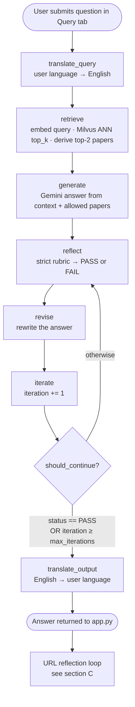
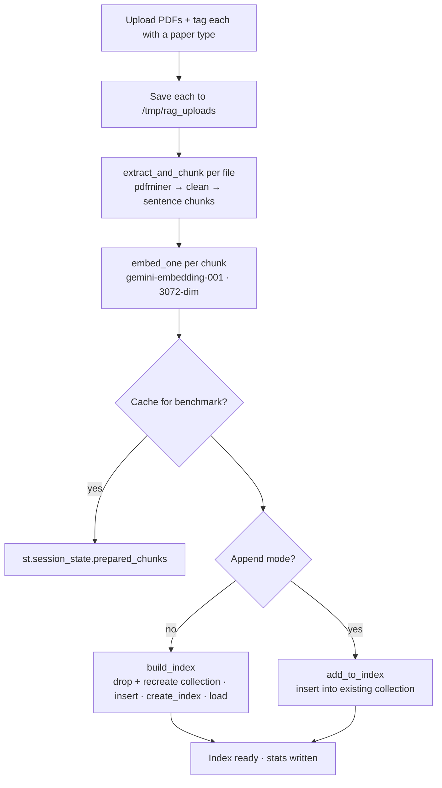
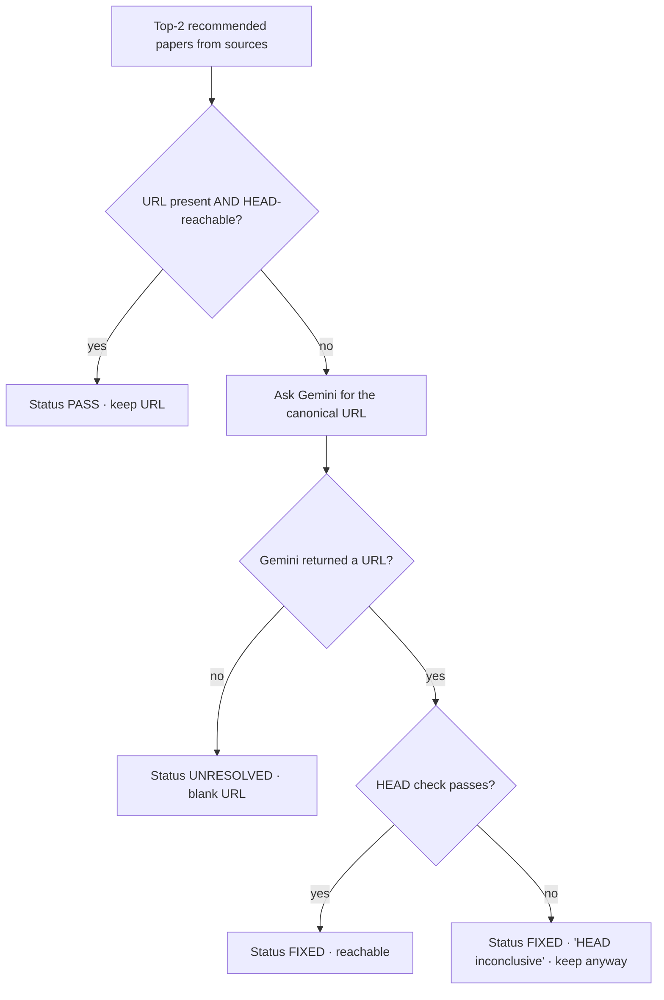

# Workflow - PDF RAG (Gemini + LangGraph + Milvus)

> What actually happens, in order, when the system runs. For the "why it exists /
> who uses it" walk-around, see [PROJECT_TOUR.md](PROJECT_TOUR.md).

This app has four workflows worth tracing. They are covered in order of how central
they are to a single use:

- [A. Answering one query](#a-answering-one-query) - the star; the LangGraph loop.
- [B. Indexing PDFs](#b-indexing-pdfs) - how uploads become searchable vectors.
- [C. URL reflection](#c-url-reflection) - the post-answer link repair (lives in the UI, not the graph).
- [D. Benchmarking three index types](#d-benchmarking-three-index-types).
- [Observable / persisted state](#observable--persisted-state) - where each workflow leaves a trace.

All exact prompt text and default values below are pulled verbatim from the source.

---

## A. Answering one query

This is the LangGraph state machine in
[`_build_graph`](../indexer.py#L632) ([indexer.py:632-826](../indexer.py#L632-L826)),
invoked from [`PDFIndexer.query`](../indexer.py#L831).



### The steps, in plain language

1. **You ask a question.** The Query tab hands your text, the top-K slider, the
   language dropdown, the model choice, the paper-type filter, and the reflection-iteration
   count to `indexer.query(...)` ([app.py:823-831](../app.py#L823-L831)).

2. **Your question is translated to English.** `translate_query` calls the translator
   microservice (`POST {TRANSLATOR_URL}/translate`) to go from your language to English.
   If the query was already English, source == target and the translator returns it
   untouched. If the translator service is unreachable, it silently falls back to
   translating with Gemini ([indexer.py:637-644](../indexer.py#L637-L644),
   [indexer.py:109-127](../indexer.py#L109-L127)).

3. **The English query is embedded and searched.** `retrieve` embeds the query with
   `gemini-embedding-001` and runs a Milvus ANN search for the top-K chunks (default
   **top_k = 4**), optionally filtered to one paper type via the expression
   `paper_type == "<filter>"`. It then walks the hits and collects the **first two unique
   source filenames** as the "allowed papers to recommend"
   ([indexer.py:647-665](../indexer.py#L647-L665)).

4. **Gemini generates a grounded answer.** `generate` builds a context block from the
   retrieved chunks and calls Gemini at **temperature 0** with the format contract below.

5. **The answer is reflected on.** `reflect` runs a *second* Gemini call with a strict
   reviewer rubric and parses a `#Verdict: PASS|FAIL` line. **If the regex finds no
   verdict, it defaults to FAIL** ([indexer.py:743-744](../indexer.py#L743-L744)).

6. **The answer is revised - always.** `revise` rewrites the answer against the reflection
   notes. See **Gotcha 1**: this runs even when reflect said PASS.

7. **The loop decides whether to go again.** `iterate` bumps the counter, then
   `should_continue` stops if the *earlier* reflect said PASS or the counter has hit
   `max_iterations` (default **2**); otherwise it loops back to `reflect`
   ([indexer.py:795-801](../indexer.py#L795-L801)).

8. **The final answer is translated back to your language.** `translate_output` translates
   English → your language (again via the translator service, Gemini fallback), and the
   answer plus retrieved sources return to the UI ([indexer.py:785-793](../indexer.py#L785-L793)).

### Exact injection points

**The hardcoded output contract** ([indexer.py:71-86](../indexer.py#L71-L86)), prepended to
every generate prompt:

```
Your response MUST follow this exact structure - no deviations:

<Your answer here, 4-6 sentences, grounded only in the provided context.>

Recommended Research Papers:
• <Exact paper title 1>. URL: <url1>
• <Exact paper title 2>. URL: <url2>

Rules:
- Use bullet points (•) for the paper list, not dashes or numbers.
- The section header must be exactly: Recommended Research Papers:
- Only list papers from the provided allowed list. Do not invent papers.
- If a real URL is available from context, use it. Otherwise write: URL: Not available
- Do NOT include any text after the second paper bullet.
```

**The generate prompt** assembled around it ([indexer.py:694-701](../indexer.py#L694-L701)):

```
{lang_instruction}{OUTPUT_FORMAT_INSTRUCTIONS}
Answer using ONLY the provided context. Do NOT invent facts.

Context:
{context}

Allowed papers to recommend (use ONLY these, exact titles):
{papers_block}

Question: {q}
```

`lang_instruction` is `""` for English, else `"Answer in {input_language}. "`
([indexer.py:688-692](../indexer.py#L688-L692)).

**The reflection prompt** ([indexer.py:133-163](../indexer.py#L133-L163)) - verbatim:

```
#Role: You are a strict RAG answer reviewer.
#Task: Decide if the answer is grounded in the provided context and follows the required format.
#Format: Return EXACTLY:
#Issues:
- ...
#Fixes:
- ...
#Verdict: PASS or FAIL

#Rules:
- FAIL if the answer includes claims not supported by the provided Context.
- FAIL if the section header is not exactly: Recommended Research Papers:
- FAIL if the papers are not listed with bullet points (•), not dashes or numbers.
- FAIL if 'Recommended Research Papers' section is missing or includes papers not in the provided list.
- FAIL if the answer is unclear, contradictory, or ignores the user's question.
- FAIL if there are more than 2 recommended papers.
- FAIL if any URL is clearly wrong or unrelated to the paper title.
Question:
{question}

Context (snippets):
{context_block}

Allowed recommended papers (exact titles):
{papers_block}

Draft answer:
{answer}
```

**The revise prompt** ([indexer.py:166-193](../indexer.py#L166-L193)) - verbatim:

```
#Role: You are a careful RAG answer rewriter.
#Task: Rewrite the answer to fix the issues while staying grounded in Context.
#Rules:
- Use ONLY the provided Context for factual claims.
- The section header must be exactly: Recommended Research Papers:
- List papers using bullet points (•), not dashes or numbers. Max 2 papers.
- List ONLY papers from the Allowed recommended papers list. Do NOT invent papers.
- Keep the answer concise (2-4 sentences) and directly responsive.
- If the original URL was not relevant to the paper title, remove it in the revision.
- After removing irrelevant URL, add a URL that is relevant to the paper title.
- If no URL is known, write: URL: Not available

Question:
{question}

Context (snippets):
{context_block}

Allowed recommended papers (exact titles):
{papers_block}

Reflection:
{reflection}

Previous answer:
{answer}
```

### Gotchas - only visible by tracing execution order

> **Gotcha 1 - `revise` runs even when the answer PASSes, and the last revision is never
> re-checked.**
> The graph wires `reflect → revise` **unconditionally**, and the PASS/FAIL branch lives
> one node later at `iterate` ([indexer.py:816-822](../indexer.py#L816-L822)):
> ```python
> builder.add_edge("reflect", "revise")          # always
> builder.add_edge("revise", "iterate")
> builder.add_conditional_edges("iterate", should_continue,
>                               {"continue": "reflect", "stop": "translate_output"})
> ```
> So the sequence is `generate → reflect → revise → iterate → (check)`. Even if reflect
> returns PASS on the generated answer, **revise has already rewritten it**, and the
> answer you get back is that rewrite - which was never itself reflected on. The
> README's diagram (`reflect --PASS--> translate_output`, `reflect --FAIL--> revise`) does
> **not** match the code. Practical effect: `revise` executes a **minimum of once** and up
> to `max_iterations` times, never zero.

> **Gotcha 2 - language is handled twice and the two can compound.**
> On a non-English query, `generate` is told `"Answer in {input_language}. "`, so Gemini
> may already produce e.g. Spanish. Then `translate_output` calls the translator with
> `source_language="English", target_language="Spanish"`
> ([indexer.py:787-792](../indexer.py#L787-L792)). Because source != target as *strings*, the
> same-language short-circuit doesn't fire - it will translate already-Spanish text *as if
> it were English*. Two features both act on the answer's language, at different points in
> the pipeline.

> **Gotcha 3 - reflect defaults to FAIL when it can't find a verdict.**
> `status = verdict_match.group(1).upper() if verdict_match else "FAIL"`
> ([indexer.py:743-744](../indexer.py#L743-L744)). If Gemini's reviewer output doesn't contain
> a literal `#Verdict: PASS` / `#Verdict: FAIL` line, the answer is treated as failing and
> the loop keeps revising until `max_iterations`. A formatting slip in the *reviewer's*
> output, not the answer, costs you extra iterations.

> **Gotcha 4 - the embedding "task type" is ignored.**
> `embed_one(text, task=...)` accepts a task like `"retrieval_document"` vs
> `"retrieval_query"` but always calls `embedder.embed_query(text)` regardless
> ([indexer.py:481-485](../indexer.py#L481-L485)). Documents and queries are embedded
> identically; the task argument is decorative.

> **Gotcha 5 - changing model or language rebuilds the graph mid-query.**
> `query()` compares the requested model/output-language to the instance's current values
> and, if either differs, calls `_build_graph()` again before invoking
> ([indexer.py:843-854](../indexer.py#L843-L854)). The graph closes over `self.model` /
> `self.output_language`, so switching the sidebar dropdowns silently recompiles the state
> machine on the next query.

---

## B. Indexing PDFs

Driven by the *Start Indexing* button ([app.py:596-759](../app.py#L596-L759)); the heavy
lifting is in [`PDFIndexer`](../indexer.py#L398).



### The steps

1. **Upload and tag.** You drop PDFs and assign each a paper type from
   `["AI / ML", "Security", "Other"]` ([indexer.py:51-55](../indexer.py#L51-L55)). Each file
   is written to `/tmp/rag_uploads/` ([app.py:120-123](../app.py#L120-L123)).

2. **Extract text, page by page.** `pdfminer` pulls text containers per page; `_clean`
   collapses whitespace and strips non-ASCII (`[^\x20-\x7E\n]`)
   ([indexer.py:400-422](../indexer.py#L400-L422)). **A page with no extractable text is
   dropped** - image-only/scanned PDFs produce nothing (this is exactly what
   [validate_papers.py](validate_papers.py) warns about).

3. **Chunk by sentences with overlap.** `_chunk_text` splits on sentence boundaries and
   packs sentences up to **chunk_size words** (slider default **400**), carrying a tail of
   up to **chunk_overlap words** (default **50**) into the next chunk
   ([indexer.py:447-476](../indexer.py#L447-L476), sliders at
   [app.py:481-482](../app.py#L481-L482)).

4. **Embed every chunk.** One Gemini embedding call per chunk, producing a **3072-dim**
   vector ([app.py:669-672](../app.py#L669-L672)).

5. **(Optional) cache for benchmarking.** If "Cache chunks for benchmarking" is on, the
   embedded chunks are stashed in session state so Workflow D can reuse them
   ([app.py:678-681](../app.py#L678-L681)).

6. **Build or append the Milvus index.**
   - **Fresh build** (`drop_old` / not append mode): `build_index` **drops and recreates
     the collection**, inserts all rows, creates the ANN index on the `embedding` field,
     and loads the collection into memory ([indexer.py:511-558](../indexer.py#L511-L558)).
   - **Append**: `add_to_index` inserts into the existing collection without recreating
     ([indexer.py:560-587](../indexer.py#L560-L587)).

7. **Stats are written** to `st.session_state.index_stats` and the file/URL maps are
   updated ([app.py:713-729](../app.py#L713-L729)).

### Exact index parameters ([indexer.py:329-376](../indexer.py#L329-L376))

All three use **`metric_type: COSINE`**.

| Index type | Build params | Search params |
|---|---|---|
| **HNSW** | `M: 32, efConstruction: 200` | `ef: 128` |
| **IVF_PQ** | `nlist: 128, m: 8, nbits: 8` | `nprobe: 16` |
| **DiskANN** | `{}` (Milvus defaults; sent as `"DISKANN"`) | `{}` |

> **Gotcha 6 - a fresh index quietly wipes the previous corpus.**
> The interactive collection is always named `"papers_rag_interactive"`
> ([app.py:637](../app.py#L637)), and a non-append build calls
> `_drop_and_recreate_collection_for_index_type()`
> ([indexer.py:495-509](../indexer.py#L495-L509)) - so indexing a new set of PDFs without
> ticking "Append to existing index" **drops everything indexed before**, even though the
> UI's "Indexed Files" list is separate session state.

> **Gotcha 7 - `text` is truncated to 65,535 chars on insert.**
> Both `build_index` and `add_to_index` do `str(c["text"])[:65535]`
> ([indexer.py:532](../indexer.py#L532)). With a 400-word chunk default this never bites, but
> the schema's `VARCHAR(65535)` cap is enforced by silent truncation, not an error.

---

## C. URL reflection

This runs **in the UI layer after the graph returns** ([app.py:181-269](../app.py#L181-L269)),
per recommended paper. It is *not* part of the LangGraph pipeline.



### The steps

1. For each of the top-2 papers, if it already has a URL that returns HTTP < 400 on a
   `HEAD` request → **PASS**, keep it ([app.py:237-241](../app.py#L237-L241)).
2. Otherwise ask Gemini for the canonical URL with this prompt
   ([app.py:197-204](../app.py#L197-L204)), verbatim:
   ```
   You are a research paper URL resolver. Given a paper title, return ONLY the single
   most likely canonical URL (arXiv abstract page, DOI link, or official venue page).
   Return the raw URL only - no explanation, no markdown, no extra text. If you are not
   confident, return an empty string.

   Paper title: {paper_title}
   ```
3. If Gemini returns a URL, HEAD-check it. **Either way it is marked `FIXED` and kept**  - 
   a failed HEAD only changes the note to "HEAD check inconclusive"
   ([app.py:249-261](../app.py#L249-L261)). If Gemini returns nothing → **UNRESOLVED**, blank.
4. The full trace (original URL, final URL, status, note) is shown in the *URL reflection
   trace* expander ([app.py:288-309](../app.py#L288-L309)).

> **Gotcha 8 - `FIXED` does not mean "reachable."**
> Because IEEE/ACM/Springer often block HEAD requests, the code deliberately keeps an
> LLM-supplied URL even when the HEAD check fails, labeling it `FIXED` with an
> "inconclusive" note. A green-looking `FIXED` status can still be a dead or hallucinated
> link ([app.py:254-261](../app.py#L254-L261)).

---

## D. Benchmarking three index types

`_run_index_benchmark_all_methods` ([app.py:313-449](../app.py#L313-L449)), gated behind
having cached chunks from Workflow B.

### The steps

1. Reuse the **cached embedded chunks** (fair comparison - no re-embedding).
2. For each method in **HNSW, IVF_PQ, DiskANN**, build a *separate* collection
   `papers_rag_{run_id}_{method}` with `drop_old_collection=True`, time `build_index`, run
   the same sample query once, and time it ([app.py:362-395](../app.py#L362-L395)).
3. Run the top-2 recommendations through **URL reflection** (Workflow C)
   ([app.py:400-401](../app.py#L400-L401)).
4. Write `{method}_answer.txt` and `{method}_sources.json`, then a combined
   `benchmark_results.csv`, into `./benchmarks/run_<timestamp>/`
   ([app.py:423-447](../app.py#L423-L447)).
5. If a method throws (e.g. DiskANN unsupported on the Milvus build), that row is recorded
   with `notes: "FAILED: ..."` and the others still complete
   ([app.py:428-444](../app.py#L428-L444)).

> **Gotcha 9 - build time and query latency are measured; storage is not.**
> `index_build_sec`, `one_query_sec`, and `end_to_end_sec` are real
> `time.perf_counter()` deltas. But `estimated_storage_mb` is
> `raw_vector_mb × overhead`, where overhead is a **hardcoded constant**  - 
> `{HNSW: 1.4, IVF_PQ: 0.3, DiskANN: 1.3}` ([app.py:355-367](../app.py#L355-L367)). The
> storage ranking in the CSV is baked into the multipliers, not observed from Milvus.

> **Gotcha 10 - the two saved benchmark runs used a different corpus than ships in `papers/`.**
> `benchmarks/run_*/benchmark_results.csv` recommend `AI_04_LLaMA_2.pdf`, `AI_02_BERT.pdf`,
> `AI_06_LoRA.pdf`. The shipped `papers/` folder is 60 clinical-nutrition PDFs. The saved
> results were produced against an AI-paper corpus that is no longer in the repo. (See
> [PROJECT_TOUR.md](PROJECT_TOUR.md) §7.)

---

## Observable / persisted state

Where each workflow leaves something you can go check:

| What | Where it lives | Survives pod/app restart? | Written by |
|---|---|---|---|
| Vector data (chunks + embeddings) | Milvus collection (`papers_rag_interactive`, or `papers_rag_<run>_<method>`) | **Yes** (Milvus is persistent) | Workflow B / D |
| Indexed-file list, paper-type & URL maps | `st.session_state` | **No** - lost on restart | Workflow B |
| Chat history | `st.session_state.chat_history` | No | Workflow A |
| Cached benchmark chunks | `st.session_state.prepared_chunks` | No | Workflow B (if caching on) |
| Per-method answers & sources | `./benchmarks/run_<ts>/{METHOD}_answer.txt`, `_sources.json` | **Yes** (on disk) | Workflow D |
| Benchmark table | `./benchmarks/run_<ts>/benchmark_results.csv` (also downloadable) | **Yes** | Workflow D |
| Index metrics (files, chunks, dims, model) | `st.session_state.index_stats` → Stats tab | No | Workflow B |
| URL repair trace | *URL reflection trace* expander (display only) | No | Workflow C |

**Runtime defaults you can change in the sidebar** ([app.py:452-496](../app.py#L452-L496)):
Query language (English), Index type (HNSW), Chunk size (400w), Chunk overlap (50w),
Gemini model (`gemini-2.0-flash`), Top-K (4), Reflection iterations (2).

---

_Saved by `/workflow-architecture`. Cross-reference: [PROJECT_TOUR.md](PROJECT_TOUR.md)._
